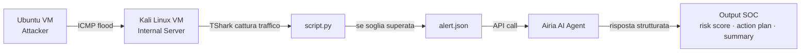

# AI-Driven SOC Analyst — Home Lab

Workflow SOC automatizzato end-to-end: dalla cattura del traffico di rete al triage tramite agente AI, senza intervento manuale.[README.md](https://github.com/user-attachments/files/26331585/README.md)

---

## Cosa dimostra questo progetto

In un SOC reale, la maggior parte del lavoro degli analisti junior è ripetitivo: stessi alert, stesse analisi, stesso triage. Questo lab replica quel problema e lo risolve con l'automazione.

Il sistema rileva traffico sospetto su una rete virtuale, genera un alert strutturato e lo invia a un agente AI addestrato con un playbook SOC. L'agente risponde con una classificazione della minaccia, un risk score, un piano d'azione e un executive summary — tutto in modo autonomo.

---

## Architettura



---

## Workflow tecnico

| Step | Operazione | Strumento |
|------|------------|-----------|
| 1 | Cattura traffico in tempo reale su `eth0` | TShark |
| 2 | Conversione `.pcap` → `.csv` | Python |
| 3 | Analisi: se un IP supera 30 pacchetti viene flaggato | Python |
| 4 | Generazione automatica di `alert.json` | Python |
| 5 | Invio alert all'agente AI via API REST | Requests |
| 6 | Triage AI basato su playbook SOC | Airia AI + GPT-4o Nano |

---

## Logica del SOC Playbook (agente AI)

L'agente non è un chatbot generico. Segue istruzioni precise che definiscono come analizzare ogni alert:

- **Input validation** — verifica che l'alert sia in formato JSON valido
- **Threat classification** — categorizza il tipo di minaccia
- **Risk scoring** — assegna un punteggio da 1 a 10
- **MITRE ATT&CK mapping** — associa le tattiche rilevate al framework
- **Action plan** — determina l'azione: monitorare, resettare credenziali, escalare
- **Escalation logic** — decide se l'alert richiede intervento umano
- **Executive summary** — spiega la situazione in linguaggio non tecnico

Sono anche definiti guardrail espliciti: l'agente non genera codice exploit, non inventa telemetria mancante e dichiara apertamente quando i dati sono insufficienti per una valutazione.

---

## Skill applicate

| Area | Dettaglio |
|------|-----------|
| Network analysis | Cattura e parsing di pacchetti con TShark |
| Python scripting | Automazione completa del pipeline di rilevamento |
| API integration | Comunicazione con piattaforma AI enterprise via REST |
| AI orchestration | Configurazione agente + prompt engineering per contesto SOC |
| Prompt engineering | SOC playbook strutturato con sezioni, output format e guardrail |
| Virtualizzazione Linux | Ambiente multi-VM su VirtualBox con rete bridge |
| SOC methodology | Triage, risk scoring, escalation logic |

---

## Requisiti

- VirtualBox con due VM (Ubuntu + Kali Linux) su rete bridge
- Python 3.x con le librerie `subprocess`, `csv`, `requests`, `json`
- TShark installato sulla VM server
- Account Airia AI con API key attiva

---

## Come eseguirlo

**1. Avvia il monitoraggio sulla VM server (Kali Linux):**

```bash
python3 soc_monitor.py
```

**2. Genera traffico dalla VM attacker (Ubuntu):**

```bash
ping -c 50 <IP_SERVER>
```

Lo script cattura il traffico, analizza i pacchetti e — se la soglia viene superata — invia l'alert all'agente AI e stampa la risposta a schermo.

---

## Esempio di output

```
[!] IP sospetto rilevato: 192.168.0.239 (70 pacchetti)
[*] Alert inviato ad Airia AI...
[+] Risposta ricevuta (HTTP 200)

Alert Type   : Suspicious ICMP Flood
Risk Score   : 6 / 10
Action       : Monitor
Escalate     : No
MITRE Tactic : Reconnaissance (T1595)
Summary      : Rilevato volume anomalo di pacchetti ICMP da un singolo host
               interno. Nessuna compromissione confermata. Consigliato
               monitoraggio continuato nelle prossime 24 ore.
```

---

*Home lab personale — realizzato per approfondire l'intersezione tra cybersecurity e AI applicata ai workflow SOC.*
