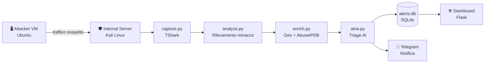

# AI-Driven SOC Analyst — Home Lab

Pipeline SOC automatizzata end-to-end: rileva minacce di rete in tempo reale, le analizza tramite agente AI e invia notifiche istantanee — senza intervento manuale.

---

## Il problema che risolve

In un SOC reale, gli analisti junior passano la maggior parte del tempo su lavoro ripetitivo: stessi alert, stessa analisi, stesso triage. Questo progetto automatizza quell'intero ciclo su un ambiente homelab, dalla cattura del pacchetto alla notifica su Telegram.

---

## Come funziona — pipeline in 6 step



| Step | Script | Cosa fa |
|------|--------|---------|
| 1 | `capture.py` | Cattura traffico di rete con TShark su `eth0` |
| 2 | `analyze.py` | Rileva ICMP Flood, Port Scan, SSH Brute Force |
| 3 | `enrich.py` | Arricchisce l'IP con geolocalizzazione (ip-api.com) e reputazione (AbuseIPDB) |
| 4 | `airia.py` | Invia l'alert all'agente AI e ottiene il verdetto SOC |
| 5 | `db.py` | Persiste l'alert su database SQLite |
| 6 | `notifier.py` | Invia notifica real-time via Telegram Bot |

La pipeline viene eseguita ogni 5 minuti tramite cron. La dashboard Flask (`dashboard.py`) permette di consultare lo storico degli alert via browser.

---

## Minacce rilevate

| Tipo | Come viene rilevata | Soglia |
|------|---------------------|--------|
| **ICMP Flood** | Pacchetti ICMP verso il server target | > 40 pacchetti |
| **Port Scan** | Porte TCP uniche raggiunte via SYN | > 10 porte |
| **SSH Brute Force** | Fallimenti di login in `/var/log/auth.log` | > 5 tentativi |

---

## Agente AI — SOC Playbook

L'agente AI non risponde a testo libero: segue un playbook strutturato in 12 sezioni che definisce esattamente come analizzare ogni alert.

Per ogni minaccia rilevata produce un output JSON con:

- **Threat classification** — categoria della minaccia (es. *Suspicious Network Volume*, *Brute Force Attempt*)
- **Risk score (0–100)** — calcolato con modello additivo su packet count, time window, porta target, protocollo
- **MITRE ATT&CK mapping** — fino a due tecniche verificate da ATT&CK v15+
- **False positive assessment** — valutazione attiva se l'alert è rumore legittimo
- **Action plan** — azioni prioritizzate: monitorare, bloccare IP, escalare, isolare host
- **Escalation logic** — score ≥ 80 → escalation entro 15 min · score 60–79 → Tier 2 entro 1 ora
- **Executive summary** — spiegazione in linguaggio non tecnico per chi non è del settore

Guardrail integrati: l'agente non genera codice exploit, non inventa dati mancanti, dichiara esplicitamente quando le informazioni sono insufficienti.

---

## Prompt Engineering

Il SOC playbook è stato generato tramite **Claude Code**, utilizzando una skill specializzata per il prompt engineering.

L'approccio è stato strutturato in tre fasi:

1. Definizione del contesto — agente AI in modalità esclusivamente difensiva, con ruolo da analista SOC enterprise
2. Specifica delle sezioni — input validation, chain-of-thought reasoning, scoring model, MITRE mapping, false positive assessment, escalation logic, guardrail, output format
3. Generazione e validazione — il playbook prodotto da Claude Code è stato testato con alert reali fino a ottenere output JSON coerenti e professionali

Il playbook completo è nel file [`soc_playbook.txt`](./soc_playbook.txt).

---

## Integrazioni esterne

| Servizio | Funzione |
|----------|----------|
| [AbuseIPDB](https://www.abuseipdb.com) | Reputazione IP e threat intelligence |
| [ip-api.com](http://ip-api.com) | Geolocalizzazione IP (gratuita) |
| [Airia AI](https://airia.com) | Piattaforma di orchestrazione AI per il triage SOC |
| Telegram Bot API | Notifiche real-time degli alert |

---

## Skill applicate

| Area | Dettaglio |
|------|-----------|
| Network analysis | Cattura e parsing pacchetti con TShark; rilevamento ICMP Flood, Port Scan, SSH Brute Force |
| Python scripting | Pipeline modulare a 6 step con orchestrazione via `main.py` |
| API integration | AbuseIPDB, ip-api.com, Airia AI, Telegram Bot — tutte con gestione credenziali via `.env` |
| AI orchestration | Configurazione agente Airia AI con playbook SOC a 12 sezioni |
| Prompt engineering | SOC playbook generato con Claude Code — scoring model, guardrail, output JSON stretto |
| Database | Persistenza alert su SQLite con query parametrizzate (prevenzione SQL injection) |
| Web development | Dashboard Flask per lo storico alert, accessibile solo in localhost con HTTP Basic Auth |
| Automazione | Scheduling pipeline via cron ogni 5 minuti |
| Virtualizzazione Linux | Ambiente multi-VM su VirtualBox con rete bridge (Ubuntu + Kali Linux) |
| Security best practice | Credenziali in `.env`, `.gitignore`, `chmod 600` su file sensibili |

---

## Struttura del progetto

```
.
├── main.py            # Orchestratore — esegue i 6 step in sequenza
├── config.py          # Carica variabili da .env
├── capture.py         # Step 1: cattura traffico
├── analyze.py         # Step 2: rilevamento minacce
├── enrich.py          # Step 3: arricchimento IP
├── airia.py           # Step 4: triage AI
├── db.py              # Step 5: persistenza SQLite
├── notifier.py        # Step 6: notifica Telegram
├── dashboard.py       # Dashboard web Flask
├── soc_playbook.txt   # Prompt di sistema per l'agente AI
├── .env.example       # Template configurazione (il .env vero non è committato)
└── .gitignore
```

---

## Setup rapido

```bash
# 1. Installa le dipendenze
sudo apt install tshark
pip install requests python-dotenv flask

# 2. Configura le credenziali
cp .env.example .env
nano .env   # Inserisci API key Airia, AbuseIPDB, Telegram token e IP del server

# 3. Inizializza il database
python db.py

# 4. Esegui la pipeline
python main.py

# 5. Avvia la dashboard (opzionale)
python dashboard.py   # → http://127.0.0.1:5000
```

**Scheduling automatico:**
```bash
crontab -e
# Aggiungi:
*/5 * * * * /usr/bin/python3 /path/to/main.py >> /var/log/soc_pipeline.log 2>&1
```

---

## Esempio di output

Alert JSON inviato all'agente:

```json
{
    "alert_id": "SOC-3F8A1C2D",
    "alert_type": "Suspicious Network Volume",
    "indicator_type": "ip",
    "indicator_value": "192.168.1.45",
    "destination_host": "Internal-server",
    "destination_ip": "192.168.1.11",
    "evidence": {
        "packet_count": 57,
        "time_window_seconds": 100,
        "data_source": "traffic.pcap"
    }
}
```

Risposta dell'agente AI:

```json
{
    "alert_id": "SOC-3F8A1C2D",
    "threat_classification": "Suspicious Network Volume",
    "risk_score": 55,
    "risk_level": "Medium",
    "score_breakdown": ["> 50 packets: +30", "60-299s window: +10", "ICMP pattern: +15"],
    "mitre_mapping": {
        "primary": { "tactic": "Reconnaissance", "technique_id": "T1595", "technique_name": "Active Scanning" }
    },
    "false_positive_indicators": ["Volume consistent with automated ping test or monitoring agent"],
    "recommended_actions": [
        { "action": "Monitor and observe for recurrence", "priority": "Medium" },
        { "action": "Enrich with threat intelligence (geo-IP, ASN)", "priority": "Medium" }
    ],
    "escalation_required": false,
    "escalation_sla": "Flag for daily summary report",
    "executive_summary": "Un dispositivo interno ha inviato un volume anomalo di richieste verso il server. Nessuna compromissione confermata. Consigliato monitoraggio nelle prossime 24 ore."
}
```

*Home lab personale — realizzato per approfondire l'intersezione tra cybersecurity e AI applicata ai workflow SOC.*
